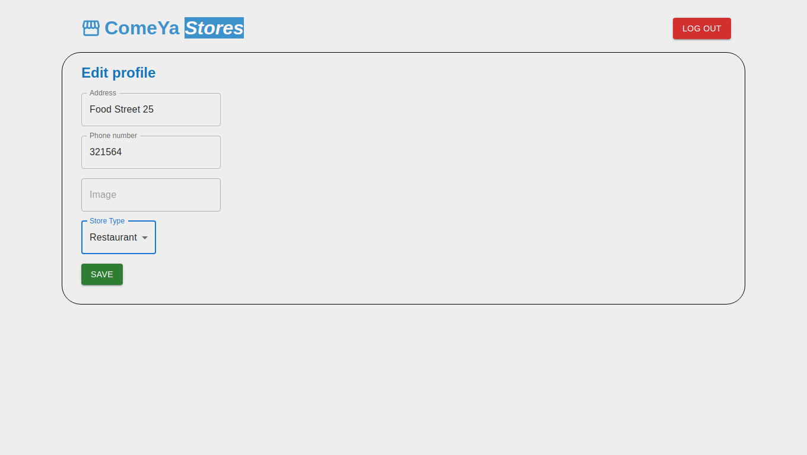

# ComeYa - Frontend
A simple food ordering app

## Introduction
ComeYa is a project that I set out to do during the month of January 2022. The goal was to learn and develop the application with NodeJS and React, and then publish it on my curriculum.
ComeYa is a food ordering application, from a user to a store or restaurant. It is inspired by [PedidosYa](https://www.pedidosya.com.ar/)
This is the frontend, to see the backend [click here](https://github.com/FranZavalla/comeya-backend/)

### Table of contents
- [Install](#install)
- [Run](#run)
- [Dependencies](#dependencies)
- [Screenshots](#screenshots)
- [ToDo](#todo)
- [Bugs](#bugs)

# Install

- ```npm install```

# Run

**Note**: you need React to run the frontend

- ```npm start```

# Dependencies
For the design and development of the frontend, I used:
- Material UI (MUI)
- React-hot-toast
- React-star-ratings
- Use-sound

# Screenshots

**Home page for users**


**Sign up for users**


**Home page for stores**


**Store administration**


**Adding a product**


**Editing store profile**



**Main page for users**


**Products administration**


**Ordering from a store**


**Viewing the cart**


**Store receiving the order**


# ToDo
### The following features were not implemented due to lack of time/knowledge. The project was thought to be developed in a month

- Testing!

- Change localStorage in frontend to cookies sent from backend
- Implement images to users, stores and products
- Delete products in cart
- Change the username/store_name to an email and use it as a primary key in the database
- Add an automatic update of new orders for stores
- Add a notice message to users when their order is accepted/cancelled

# Bugs

- If you enter /menu/orders directly from the search bar, the browser will not render anything
